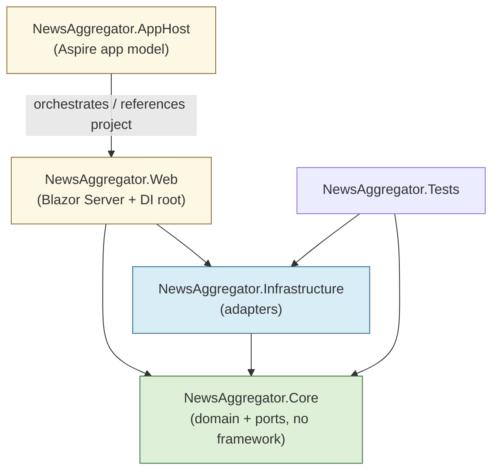
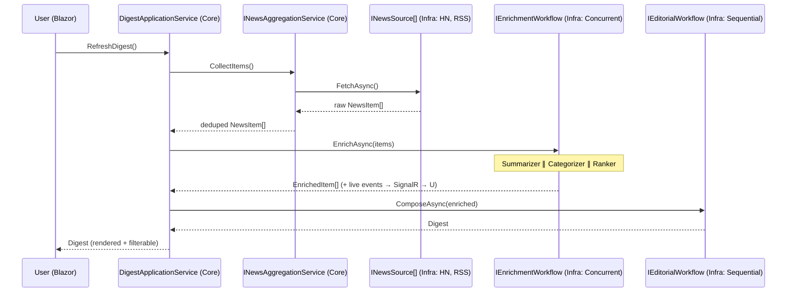

# 2. Architecture & Project Structure

[← Overview](01-overview-and-mvp-scope.md) · [Index](README.md) · [Next: Agent Orchestration →](03-agent-orchestration-design.md)

## 2.1 Pragmatic Clean Architecture — five projects only

```
News-Aggregator/
├─ docs/                         # this documentation set
└─ src/
   ├─ NewsAggregator.AppHost          # .NET Aspire orchestrator (composition root for infra)
   ├─ NewsAggregator.Web              # Blazor Server UI + application entry (composition root for DI)
   ├─ NewsAggregator.Core             # Domain + application logic + ports (NO framework refs)
   ├─ NewsAggregator.Infrastructure   # Adapters: sources, model providers, agents, caching
   └─ NewsAggregator.Tests            # Unit + workflow smoke tests
```

> A `ServiceDefaults` project is the conventional 6th project in Aspire templates.
> To honor the "five projects unless a strong rationale exists" constraint, the
> **ServiceDefaults extension method lives inside `NewsAggregator.Web`** (a single
> `Extensions/ServiceDefaultsExtensions.cs`). Rationale: with only one runnable
> service in the MVP, a shared defaults project earns its keep only when ≥2 services
> consume it. This is called out as a deliberate, reversible tradeoff
> (see [§7](07-solid-tradeoffs-and-roadmap.md)).

### Project responsibilities

| Project | Depends on | Responsibility | Must NOT contain |
| --- | --- | --- | --- |
| **Core** | *(BCL only)* | Domain entities (`NewsItem`, `EnrichedItem`, `Digest`), value objects, application services (orchestration use-cases), and **ports** (interfaces). | Any reference to Agent Framework, Aspire, ASP.NET, OpenAI/Ollama SDKs. |
| **Infrastructure** | Core | **Adapters** implementing Core ports: source connectors (HN, RSS), model-provider factories (Ollama, OpenRouter), agent factory, workflow runners, caching. | UI concerns; business rules. |
| **Web** | Core, Infrastructure | Blazor Server UI, DI composition root, configuration binding, SignalR streaming of agent events, ServiceDefaults. | Business logic; direct SDK calls. |
| **AppHost** | *(references Web as an Aspire resource)* | Aspire app model: declare Web, Ollama, optional Redis; wire env/connection strings; dashboard/telemetry. | Application logic of any kind. |
| **Tests** | Core, Infrastructure (+ test SDK) | Unit tests for Core, adapter tests with fakes, a workflow smoke test. | — |

## 2.2 The dependency rule (enforced by project references)



**Rule:** dependencies point inward toward `Core`. `Core` has no outward
dependency. `Infrastructure` may know `Core`; never the reverse. The composition
root (`Web/Program.cs`) is the *only* place adapters are bound to ports.

## 2.3 Ports & adapters (Dependency Inversion in practice)

The whole "no framework coupling in Domain" rule hinges on Core defining its own
abstractions and Infrastructure adapting external SDKs to them.

| Core port (in `Core`) | Adapter (in `Infrastructure`) | Wraps |
| --- | --- | --- |
| `INewsSource` | `HackerNewsSource`, `RssNewsSource` | HTTP + Firebase HN API / `System.ServiceModel.Syndication` |
| `INewsAggregationService` | *(implemented in Core)* uses `INewsSource[]`, dedupe | — |
| `IAgentFactory` | `AgentFrameworkAgentFactory` | `Microsoft.Agents.AI` `ChatClientAgent` ✅ |
| `IChatModelProvider` | `OllamaChatModelProvider`, `OpenRouterChatModelProvider` | `Microsoft.Extensions.AI.IChatClient` ✅ |
| `IEnrichmentWorkflow` | `ConcurrentEnrichmentWorkflow` | `AgentWorkflowBuilder.BuildConcurrent` ✅ |
| `IEditorialWorkflow` | `SequentialEditorialWorkflow` | `AgentWorkflowBuilder.BuildSequential` ✅ |
| `IDigestCache` | `DistributedDigestCache` / `InMemoryDigestCache` | `IDistributedCache` / `IMemoryCache` |

> **Important nuance — where does `IChatClient` live?**
> `IChatClient` is a `Microsoft.Extensions.AI` abstraction, not the Agent Framework.
> To keep `Core` framework-free, `Core` defines provider-neutral ports
> (`IChatModelProvider`, `IAgentFactory`) in **its own** vocabulary and does **not**
> reference `Microsoft.Extensions.AI`. The `IChatClient`/`ChatClientAgent` types
> appear only in `Infrastructure`. (If the team decides `Microsoft.Extensions.AI`
> *abstractions* are stable enough to treat as a "language extension," they could be
> allowed into Core — but the MVP keeps Core strictly BCL-only. Tradeoff documented
> in [§7](07-solid-tradeoffs-and-roadmap.md).)

## 2.4 Request flow (happy path)



## 2.5 Composition root (where DI is wired)

`Web/Program.cs` is the **single composition root**. It:

1. Binds configuration (Options pattern) for sources and providers
   (see [§5](05-packages-and-configuration.md)).
2. Registers Core application services.
3. Registers Infrastructure adapters against Core ports (`AddSingleton/AddScoped`).
4. Builds the `IChatClient` pipeline
   (`.UseFunctionInvocation().UseOpenTelemetry()` ✅) per provider.
5. Adds Blazor Server, SignalR, health checks, and the ServiceDefaults extension.

No other class resolves services from the container directly — **no static service
locator anywhere**. Agents and workflows receive their dependencies via constructor
injection or via factory ports (`IAgentFactory`) that themselves are injected.

## 2.6 Why this structure satisfies the constraints

- **No God class:** the orchestration use-case is split into an aggregation service,
  two workflow adapters, and an application service that coordinates them.
- **No business logic in UI:** Blazor components call `DigestApplicationService`
  and render results/events only.
- **No framework coupling in Domain:** `Core` is BCL-only; all SDK types are in
  `Infrastructure`.
- **DI everywhere / no static locators:** all wiring is in the composition root;
  collaborators are injected.

[← Overview](01-overview-and-mvp-scope.md) · [Index](README.md) · [Next: Agent Orchestration →](03-agent-orchestration-design.md)
