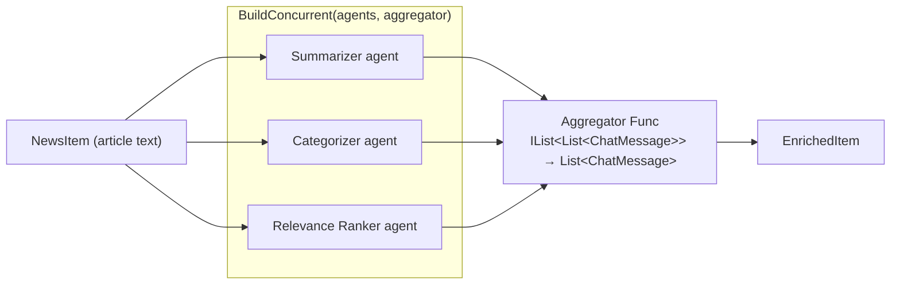
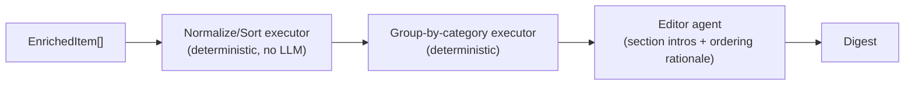
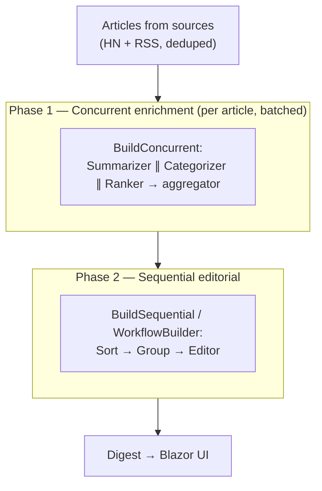

# 3. Agent Orchestration Design (Concurrent + Sequential)

[← Architecture](02-architecture-and-project-structure.md) · [Index](README.md) · [Next: Model Providers & BYOK →](04-model-providers-and-byok.md)

This is the heart of the system. It maps the agent team onto two **verified**
Microsoft Agent Framework orchestration patterns:

- **Concurrent** — fan-out/fan-in enrichment of each article (speed + diverse views).
- **Sequential** — an editorial pipeline that composes the final digest.

> **Verified building blocks** (see [§5](05-packages-and-configuration.md) for
> packages/versions). All names below are confirmed against Microsoft Learn:
> - `Microsoft.Agents.AI` ✅ → `AIAgent`, `ChatClientAgent`
> - `Microsoft.Agents.AI.Workflows` ✅ → `AgentWorkflowBuilder.BuildConcurrent(...)`,
>   `AgentWorkflowBuilder.BuildSequential(...)`, `WorkflowBuilder`,
>   `InProcessExecution.RunStreamingAsync(...)`, events `WorkflowEvent`,
>   `WorkflowOutputEvent`, `AgentResponseUpdateEvent`.

## 3.1 Creating agents (verified pattern)

An agent is any `AIAgent`. The simplest is a `ChatClientAgent` built over an
`IChatClient` (see [§4](04-model-providers-and-byok.md) for how the `IChatClient`
is produced from Ollama or OpenRouter):

```csharp
// Illustrative — verify against installed package version before use.
using Microsoft.Agents.AI;            // ✅ ChatClientAgent, AIAgent

AIAgent summarizer = new ChatClientAgent(
    chatClient,                       // Microsoft.Extensions.AI.IChatClient ✅
    instructions: "Summarize the article in 2-3 neutral sentences.");
```

In this design, agents are produced by the Core port `IAgentFactory` (adapter:
`AgentFrameworkAgentFactory`), so the workflow code never news-up an SDK type
directly — it receives ready `AIAgent` instances.

## 3.2 Agent roster → workflow mapping

| Agent | `instructions` intent | Output shape | Used in |
| --- | --- | --- | --- |
| **Summarizer** | Neutral 2–3 sentence summary. | text | Concurrent |
| **Categorizer** | Category + tags from a fixed taxonomy. | structured (category, tags[]) | Concurrent |
| **Relevance Ranker** | Significance score 0–1 + one-line justification. | structured (score, reason) | Concurrent |
| **Editor** | Order items, write section intros, produce digest. | text/markdown | Sequential |

> Structured outputs are supported by `ChatClientAgent` (function calling / structured
> output via `Microsoft.Extensions.AI`) ✅. For MVP, Categorizer/Ranker use a
> constrained response format; the exact `ChatResponseFormat`/JSON-schema helper API
> should be ⚠️ verified against the installed `Microsoft.Extensions.AI` version.

## 3.3 Concurrent workflow — enrichment (fan-out / fan-in)

**Goal:** for a batch of articles, run Summarizer, Categorizer, and Ranker in
parallel and aggregate their outputs into one `EnrichedItem`. This is the
classic *fan-out/fan-in* (a.k.a. scatter-gather / map-reduce) pattern.

### Verified API

`AgentWorkflowBuilder.BuildConcurrent` ✅ has these overloads:

```csharp
// Namespace: Microsoft.Agents.AI.Workflows  ✅
public static Workflow BuildConcurrent(
    IEnumerable<AIAgent> agents,
    Func<IList<List<ChatMessage>>, List<ChatMessage>>? aggregator = default);

public static Workflow BuildConcurrent(
    string workflowName,
    IEnumerable<AIAgent> agents,
    Func<IList<List<ChatMessage>>, List<ChatMessage>>? aggregator = default);
```

- All agents receive the **same input** and run independently.
- The optional **aggregator** `Func<IList<List<ChatMessage>>, List<ChatMessage>>`
  reduces each agent's output messages into one result list. If `null`, the default
  is "the last message from each agent that produced one."
- For MVP we supply a **custom aggregator** that parses each agent's last message
  into the `EnrichedItem` fields (summary / category+tags / score). The parsing/merge
  logic lives in a small Core mapper so it stays testable and framework-free; the
  aggregator delegate (in Infrastructure) just calls it.

### Diagram



### Execution & event streaming (verified)

```csharp
// Illustrative — verify names against installed package version.
using Microsoft.Agents.AI.Workflows;  // ✅

Workflow workflow = AgentWorkflowBuilder.BuildConcurrent(
    agents: new[] { summarizer, categorizer, ranker },
    aggregator: mergeIntoEnrichedItem);

StreamingRun run = await InProcessExecution.RunStreamingAsync(workflow, input); // ✅

await foreach (WorkflowEvent evt in run.WatchStreamAsync())                     // ✅
{
    switch (evt)
    {
        case AgentResponseUpdateEvent update:   // ✅ stream progress → SignalR → Blazor
            // forward to UI via IProgress<AgentProgress> (Core port)
            break;
        case WorkflowOutputEvent output:        // ✅ final aggregated result
            // map to EnrichedItem
            break;
    }
}
```

> **Batching note:** "concurrent across agents" parallelizes the *three agents over one
> article*. To process *many articles*, the application service loops/batches articles
> (bounded by `Parallel`/`SemaphoreSlim` to respect model concurrency limits — local
> Ollama especially). Do **not** rely on `BuildConcurrent` to parallelize across
> articles; it parallelizes the agent set over a single input.

## 3.4 Sequential workflow — editorial pipeline

**Goal:** take the enriched items and run an ordered pipeline where each step builds
on the previous one to produce the final `Digest`.

### Verified API

`AgentWorkflowBuilder.BuildSequential` ✅:

```csharp
// Namespace: Microsoft.Agents.AI.Workflows  ✅
Workflow workflow = AgentWorkflowBuilder.BuildSequential(agents);
```

By default each agent in the sequence consumes the **previous agent's full
conversation** (input + response); this is configurable to "response only" ✅.

For the MVP editorial pipeline we mix **agents with custom executors**, which the
framework supports — passing an `AIAgent` to `WorkflowBuilder` auto-wraps it in an
`AIAgentHostExecutor` via `AIAgentBinding` ✅. Custom (non-LLM) steps (e.g. sort by
score, group by category) are plain executors so deterministic logic stays
deterministic and testable.

### Diagram



> When the pipeline is *all agents*, `BuildSequential(agents)` is enough. When it
> mixes deterministic executors with agents (our case), use `WorkflowBuilder` with
> `AddEdge(...)` to wire executors and agent bindings into the graph ✅. Both APIs are
> in `Microsoft.Agents.AI.Workflows`.

### Execution

Same `InProcessExecution.RunStreamingAsync` + `WatchStreamAsync` event loop as §3.3,
consuming `WorkflowOutputEvent` for the final `Digest` and `AgentResponseUpdateEvent`
for live progress.

## 3.5 End-to-end orchestration



The two phases are coordinated by `DigestApplicationService` (Core), which depends on
the Core ports `IEnrichmentWorkflow` and `IEditorialWorkflow`. The concrete workflow
construction (the verified `AgentWorkflowBuilder` calls) lives in **Infrastructure**,
keeping Core free of the framework.

## 3.6 Why each pattern here (fit & tradeoffs)

| | Concurrent (enrichment) | Sequential (editorial) |
| --- | --- | --- |
| **Why** | Summary/category/score are **independent** → parallelize for latency + diverse perspectives. | Editorial steps are **dependent**: ordering needs scores; intros need groupings. |
| **Aggregation** | Custom `aggregator` merges 3 outputs into one item. | Each step feeds the next; final step emits the digest. |
| **Risk** | Model concurrency limits (esp. local Ollama) → bound parallelism. | Longer critical path; a slow step stalls the pipeline. |
| **Determinism** | LLM steps non-deterministic; merge logic deterministic & tested. | Deterministic executors isolate sortable/groupable logic from the LLM. |

> Anti-pattern avoided: we do **not** force a sequence where work is independent
> (would add latency), and we do **not** run dependent editorial steps concurrently
> (would produce inconsistent ordering). This mirrors Microsoft's official guidance on
> when to use vs avoid concurrent orchestration.

## 3.7 Deferred capabilities (available, not in MVP)

- **Human-in-the-loop** — the framework supports tool approval via
  `ApprovalRequiredAIFunction` emitting a `RequestInfoEvent` with
  `ToolApprovalRequestContent`, and `RequestPort` pause points ✅. Deferred to roadmap.
- **Handoff / Group Chat / Magentic** orchestrations ✅ exist but are out of MVP scope.
- **Durable workflows** — `WorkflowBuilder` graphs can be made durable/checkpointed
  via the Durable Task extension ✅; deferred (see [§7](07-solid-tradeoffs-and-roadmap.md)).

[← Architecture](02-architecture-and-project-structure.md) · [Index](README.md) · [Next: Model Providers & BYOK →](04-model-providers-and-byok.md)
