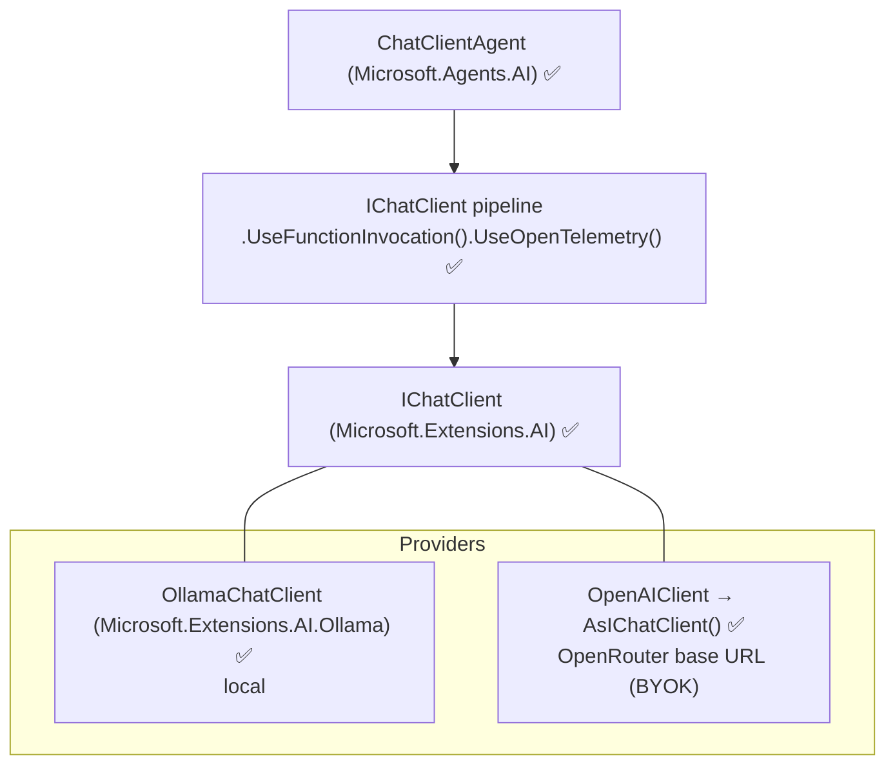
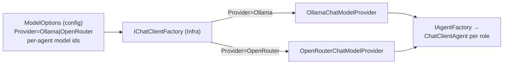

# 4. Model Providers & BYOK (Ollama + OpenRouter)

[← Agent Orchestration](03-agent-orchestration-design.md) · [Index](README.md) · [Next: Packages & Configuration →](05-packages-and-configuration.md)

**Goal:** support *local LLMs (Ollama)* and *bring-your-own-key hosted models
(OpenRouter)* **from day one**, selectable by configuration with no code change, all
behind the single `Microsoft.Extensions.AI.IChatClient` abstraction ✅.

## 4.1 The abstraction stack



`ChatClientAgent` wraps an `IChatClient`; everything below the agent is provider-neutral.
Swapping providers = swapping which `IChatClient` is built. The agent, the workflows,
and Core are unaffected.

## 4.2 Provider selection (Core port → Infrastructure adapters)

```csharp
// Core (framework-free) — provider-neutral port.
public interface IChatModelProvider
{
    // Returns a provider-specific chat model handle the Infra layer understands.
    ChatModelDescriptor Describe(string agentRole);
}
```

The concrete `IChatClient` is created in **Infrastructure** by an adapter keyed on the
configured provider. The selection is driven by `ModelOptions` (see
[§5](05-packages-and-configuration.md)): a default provider plus optional per-agent
overrides (e.g. local model for Summarizer, hosted model for Editor).



## 4.3 Ollama (local LLM) — verified, native Microsoft support

Use the **native** Microsoft package **`Microsoft.Extensions.AI.Ollama`** ✅. It
provides `OllamaChatClient` (an `IChatClient`), and the Agent Framework's
`IChatClient.AsAIAgent(...)` extension (from `Microsoft.Agents.AI`) turns it straight
into an agent. This is the approach shown in the official Agent Framework Ollama
provider docs (C#) — **no `OllamaSharp` and no Community Toolkit are required**.

```csharp
// Verbatim from Microsoft Learn (Agent Framework › Ollama provider, C#). ✅
// Requires: dotnet add package Microsoft.Extensions.AI.Ollama --prerelease   ⚠️ prerelease
using Microsoft.Agents.AI;       // ✅ AIAgent, AsAIAgent
using Microsoft.Extensions.AI;   // ✅ OllamaChatClient (Microsoft.Extensions.AI.Ollama)

var chatClient = new OllamaChatClient(
    new Uri("http://localhost:11434"),   // Ollama default port ✅
    modelId: "llama3.2");                 // model id

AIAgent agent = chatClient.AsAIAgent(     // ✅ IChatClient → AIAgent
    instructions: "You are a helpful assistant running locally via Ollama.");
```

In this design `OllamaChatClient` is created inside the Infrastructure provider
adapter and (like every provider) wrapped in the `IChatClient` pipeline of §4.5
before an agent is built — keeping telemetry/function-invocation uniform.

Notes (verified):
- Package is currently **prerelease** (`--prerelease`) ✅⚠️ — pin the exact version
  (see [§5](05-packages-and-configuration.md)) and re-verify on nuget.org.
- Ollama default endpoint is `http://localhost:11434` ✅.
- **Not all local models support tool/function calling.** For agents that use tools
  or structured output, use models known to support it (e.g. `llama3.2`, `qwen3`).
  Models without tool support still work for plain summarization.
- Embeddings (post-MVP) use the same M.E.AI family via
  `IEmbeddingGenerator<string, Embedding<float>>` ✅ (e.g. `all-minilm`).

## 4.4 OpenRouter (BYOK, OpenAI-compatible) — verified pattern, one flag

OpenRouter exposes an **OpenAI-compatible** API. Two equivalent routes, both verified
at the type level:

**Route A — via `Microsoft.Extensions.AI` directly:**
```csharp
// Illustrative — verify the endpoint-override option name (see ⚠️ below).
using Microsoft.Extensions.AI;   // ✅
using OpenAI;                     // ✅ OpenAIClient

var openAi = new OpenAIClient(
    new System.ClientModel.ApiKeyCredential(openRouterApiKey),
    new OpenAIClientOptions { Endpoint = new Uri("https://openrouter.ai/api/v1") }); // ⚠️ verify option

IChatClient chat = openAi.GetChatClient("openai/gpt-4o-mini").AsIChatClient(); // ✅ AsIChatClient
```

**Route B — straight to an agent via the Agent Framework OpenAI bridge:**
```csharp
using Microsoft.Agents.AI;        // ✅
// Microsoft.Agents.AI.OpenAI provides AsAIAgent on OpenAI.Chat.ChatClient ✅
ChatClientAgent agent = openAi
    .GetChatClient("openai/gpt-4o-mini")
    .AsAIAgent(instructions: "..."); // ✅ OpenAIChatClientExtensions.AsAIAgent
```

| Item | Status | Detail / alternative |
| --- | --- | --- |
| OpenRouter is OpenAI-compatible | ✅ | Base URL `https://openrouter.ai/api/v1`. |
| `OpenAIClient.GetChatClient(model).AsIChatClient()` | ✅ | Bridges to `IChatClient`. |
| `OpenAIChatClientExtensions.AsAIAgent(...)` | ✅ | From `Microsoft.Agents.AI.OpenAI`. |
| **Exact endpoint-override option** (`OpenAIClientOptions.Endpoint`) | ⚠️ | Property name/shape varies by OpenAI SDK version. **Verify** against the installed `OpenAI` package. *Alternative:* construct the OpenAI client with a custom transport/`HttpClient` whose `BaseAddress` points at OpenRouter. |
| OpenRouter ranking headers (`HTTP-Referer`, `X-Title`) | ❓ | Optional OpenRouter attribution headers; add via the `HttpClient`/transport if desired. Not required to function. |

> **Same mechanism also gives Ollama an OpenAI-compatible fallback:** Ollama exposes
> `http://localhost:11434/v1/` ✅. If the native `OllamaChatClient` were ever
> unsuitable, the OpenAI route pointed at that base URL is a verified backup path.
> MVP default remains the native `Microsoft.Extensions.AI.Ollama` client.

## 4.5 The `IChatClient` pipeline (cross-cutting, verified)

Whichever provider is chosen, the factory wraps the raw client in a pipeline before
handing it to an agent:

```csharp
using Microsoft.Extensions.AI;   // ✅
IChatClient client = rawClient
    .AsBuilder()                 // ✅ ChatClientBuilder
    .UseFunctionInvocation()     // ✅ enables tool calling
    .UseOpenTelemetry()          // ✅ traces/metrics → Aspire dashboard
    // .UseDistributedCache()    // ✅ optional, with Redis from Aspire
    .Build(serviceProvider);
```

This gives every provider automatic function-invocation, telemetry, and optional
caching — uniformly, in one place, via DI.

## 4.6 How this satisfies "local + BYOK from day one"

- **Local default:** Ollama requires no key and runs offline → privacy/cost control,
  great DX. It is the default provider in `appsettings.Development.json`.
- **BYOK:** OpenRouter is enabled by supplying an API key via user-secrets / env var /
  Aspire parameter (never committed) and flipping `ModelOptions.Provider`.
- **Per-agent routing:** because each agent gets its own `IChatClient`, you can run
  cheap local models for high-volume enrichment and a stronger hosted model for the
  single Editor pass — all by configuration.

[← Agent Orchestration](03-agent-orchestration-design.md) · [Index](README.md) · [Next: Packages & Configuration →](05-packages-and-configuration.md)
