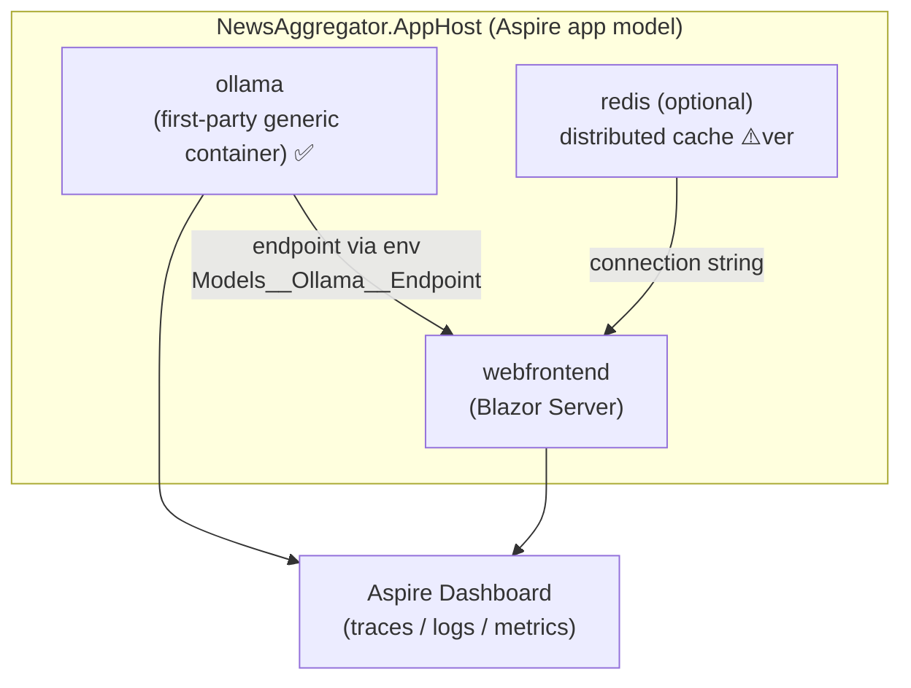
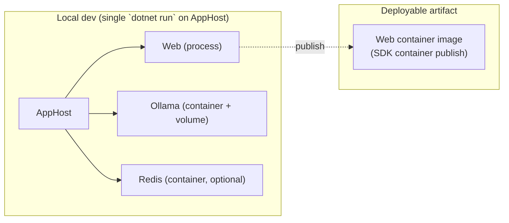

# 6. Aspire Topology & Docker Strategy

[← Packages & Configuration](05-packages-and-configuration.md) · [Index](README.md) · [Next: SOLID, Tradeoffs & Roadmap →](07-solid-tradeoffs-and-roadmap.md)

## 6.1 Aspire app model (AppHost)

`NewsAggregator.AppHost` is the composition root for **infrastructure** (not business
logic). It declares the resources, wires endpoints/connection strings, and provides the
**Aspire dashboard**, **OpenTelemetry**, and **health checks** for free.



### Illustrative AppHost wiring (first-party Aspire only)
```csharp
// Illustrative — verify Aspire API/version before use. No Community Toolkit.
var builder = DistributedApplication.CreateBuilder(args);

// Local LLM — Ollama modeled as a first-party generic container ✅
var ollama = builder.AddContainer("ollama", "ollama/ollama")  // Aspire.Hosting.AppHost
                    .WithHttpEndpoint(targetPort: 11434, name: "http")
                    .WithVolume("ollama-models", "/root/.ollama"); // persist pulled models

// Optional cache
var redis = builder.AddRedis("redis");            // ⚠️ verify version

builder.AddProject<Projects.NewsAggregator_Web>("webfrontend")
       // Inject the Ollama endpoint into the Web app's configuration.
       .WithEnvironment("Models__Ollama__Endpoint",
                        ollama.GetEndpoint("http"))   // ⚠️ verify endpoint accessor name
       .WithReference(redis)
       .WaitFor(ollama)
       .WithExternalHttpEndpoints();

builder.Build().Run();
```

> **Verified facts (corrected):**
> - The local-LLM **client** is `OllamaSharp` (`OllamaApiClient` as `IChatClient`) ✅,
>   the Microsoft-recommended Ollama client (`Microsoft.Extensions.AI.Ollama` is
>   deprecated) — **no Community Toolkit**. See [§4.3](04-model-providers-and-byok.md).
> - Aspire has **no first-party Ollama *hosting* integration**, so the Ollama runtime
>   is modeled as a **generic container** with `AddContainer(...)` (part of
>   `Aspire.Hosting.AppHost`) ✅. A named volume persists pulled models across runs.
> - The container's endpoint is passed to the Web app via configuration
>   (`Models__Ollama__Endpoint`); the provider adapter constructs the `OllamaSharp`
>   `OllamaApiClient` from it. ⚠️ Verify the exact endpoint-accessor API for your Aspire version.
> - **Alternative:** run Ollama on the host (developers already do `ollama pull`) and
>   point `Models:Ollama:Endpoint` at it — no container at all.

### ServiceDefaults
Per [§2](02-architecture-and-project-structure.md), the ServiceDefaults extension
(OpenTelemetry wiring, health-check endpoints, `Microsoft.Extensions.ServiceDiscovery`,
standard HTTP resilience) lives **inside `NewsAggregator.Web`** to keep the project
count at five. `Program.cs` calls `builder.AddServiceDefaults()`.

## 6.2 Observability
- The `IChatClient` pipeline uses `.UseOpenTelemetry()` ✅, so every model call emits
  traces/metrics visible in the Aspire dashboard.
- Workflow execution surfaces `AgentResponseUpdateEvent`/`WorkflowOutputEvent` ✅; these
  are logged and also streamed to the Blazor UI via SignalR for live progress.
- Health checks: Web liveness/readiness + a provider-reachability check (Ollama/OpenRouter).

## 6.3 Docker strategy

Two distinct concerns: **(a) running dependencies as containers during dev** (Aspire
manages this automatically) and **(b) producing a deployable image of the Web app.**

### (a) Dependencies — managed by Aspire
- **Ollama** runs as a container image (`ollama/ollama`) declared in AppHost. A
  **data volume** persists pulled models so they aren't re-downloaded each run.
- **Redis** (optional) runs as a container only when caching is set to Redis.
- No hand-written `docker compose` is required for local dev — the AppHost is the
  single entry point (`dotnet run` on AppHost starts everything).

### (b) Web app image
- `NewsAggregator.Web` ships a **multi-stage Dockerfile** (SDK build stage →
  chiseled/`aspnet` runtime stage) for size and security.
- Alternatively use **.NET SDK container publish**
  (`dotnet publish -t:PublishContainer`) to avoid maintaining a Dockerfile ✅;
  pick one and standardize (recommend SDK container publish for the MVP).
- The image is provider-agnostic: it talks to whatever `Models:Provider` resolves to,
  using endpoints/keys injected via environment variables.

### Deployment manifest
- For non-local deployment, Aspire can **generate a manifest** describing resources,
  which tools translate to compose/Kubernetes ⚠️ (verify the current
  `aspire`/`azd` manifest workflow for your Aspire version). MVP target is **local
  Aspire only**; container/manifest publishing is a roadmap item.



### GPU note (Ollama)
Local inference is CPU-bound by default. For acceptable latency with larger models,
enable GPU passthrough to the Ollama container (e.g. NVIDIA container runtime). This is
an environment/runtime concern ⚠️ (host-dependent) — document it for operators but keep
the MVP working on CPU with small models (`llama3.2`, `qwen3`).

## 6.4 Local-dev vs container tradeoffs

| | Ollama as Aspire container | Ollama installed on host |
| --- | --- | --- |
| Setup | One `dotnet run`; reproducible; volume-persisted models. | Manual install; shared across projects; uses host GPU easily. |
| Isolation | Clean, disposable. | Pollutes host but faster GPU access. |
| MVP default | **Yes** (reproducibility wins). | Supported via config (point `Models:Ollama:Endpoint` at host). |

[← Packages & Configuration](05-packages-and-configuration.md) · [Index](README.md) · [Next: SOLID, Tradeoffs & Roadmap →](07-solid-tradeoffs-and-roadmap.md)
